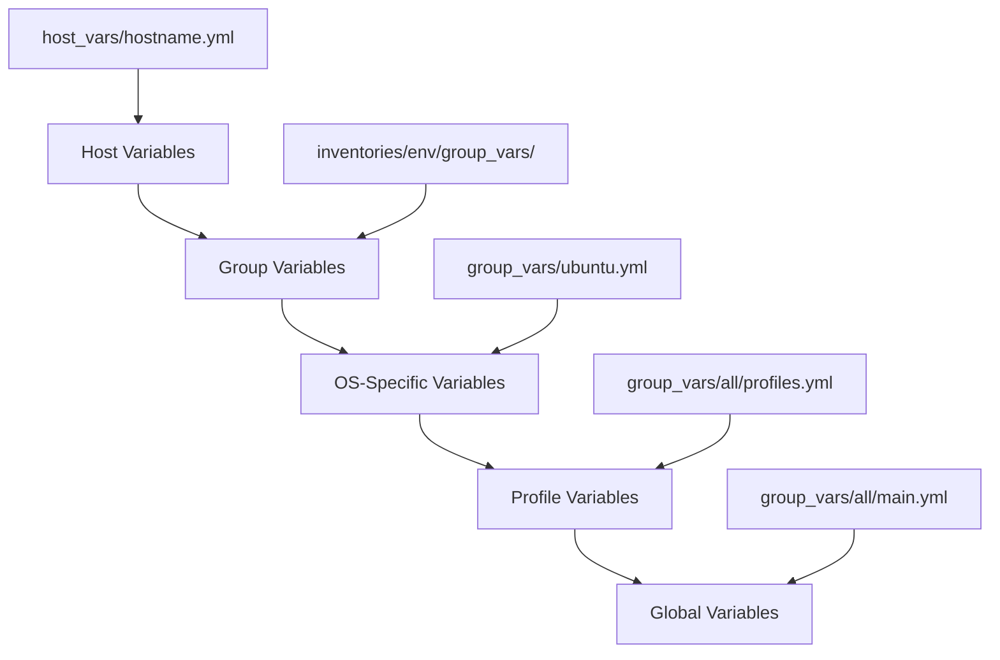
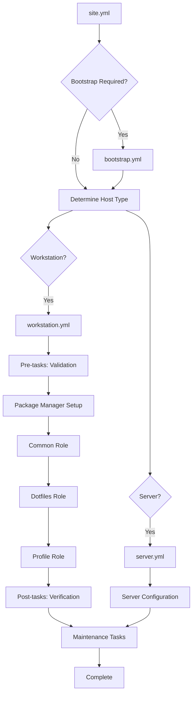

# Dotsible: Comprehensive Ansible Architecture for Cross-Platform Dotfiles Management

## Executive Summary

This document outlines the architectural design for **Dotsible**, a comprehensive Ansible repository for managing personal development environments across multiple operating systems (Ubuntu, Windows, Arch Linux, macOS) with integrated dotfiles management.

The architecture emphasizes modularity, extensibility, and profile-based configuration management while maintaining cross-platform compatibility and robust error handling.

## 1. Overall Directory Structure and Organization

```
dotsible/
├── README.md
├── ansible.cfg                    # Ansible configuration
├── requirements.yml               # External role dependencies
├── site.yml                      # Main orchestration playbook
├── 
├── inventories/                   # Environment-specific inventories
│   ├── production/
│   │   ├── hosts.yml             # Production inventory
│   │   └── group_vars/           # Production group variables
│   ├── development/
│   │   ├── hosts.yml             # Development inventory
│   │   └── group_vars/           # Development group variables
│   └── local/
│       ├── hosts.yml             # Local development inventory
│       └── group_vars/           # Local group variables
│
├── playbooks/                     # Execution playbooks
│   ├── bootstrap.yml             # Initial system setup
│   ├── workstation.yml           # Full workstation setup
│   ├── minimal.yml               # Minimal configuration
│   ├── server.yml                # Server-specific setup
│   └── maintenance.yml           # System maintenance tasks
│
├── roles/                         # Ansible roles
│   ├── common/                   # Base system configuration
│   ├── package_manager/          # Package management abstraction
│   ├── dotfiles/                 # Dotfiles management
│   ├── applications/             # Application-specific roles
│   │   ├── vim/
│   │   ├── zsh/
│   │   ├── git/
│   │   ├── tmux/
│   │   ├── alacritty/
│   │   └── ...
│   └── profiles/                 # Configuration profiles
│       ├── developer/
│       ├── minimal/
│       ├── gaming/
│       └── server/
│
├── group_vars/                    # Global group variables
│   ├── all/                      # Variables for all hosts
│   │   ├── main.yml             # Main configuration
│   │   ├── packages.yml         # Package definitions
│   │   ├── profiles.yml         # Profile definitions
│   │   └── vault.yml            # Encrypted secrets
│   ├── ubuntu.yml               # Ubuntu-specific variables
│   ├── archlinux.yml            # Arch Linux-specific variables
│   ├── macos.yml                # macOS-specific variables
│   └── windows.yml              # Windows-specific variables
│
├── host_vars/                     # Host-specific variables
│   ├── hostname1.yml
│   └── hostname2.yml
│
├── templates/                     # Jinja2 templates
│   ├── common/                   # Cross-platform templates
│   ├── ubuntu/                   # Ubuntu-specific templates
│   ├── archlinux/               # Arch-specific templates
│   ├── macos/                   # macOS-specific templates
│   └── windows/                 # Windows-specific templates
│
├── files/                        # Static files
│   ├── common/
│   ├── ubuntu/
│   ├── archlinux/
│   ├── macos/
│   └── windows/
│
├── library/                      # Custom Ansible modules
│   ├── dotfile_manager.py       # Custom dotfiles module
│   └── profile_manager.py       # Profile management module
│
├── filter_plugins/               # Custom Jinja2 filters
│   └── os_filters.py            # OS-specific filters
│
├── scripts/                      # Utility scripts
│   ├── bootstrap.sh             # Initial bootstrap script
│   ├── vault-helper.sh          # Vault management helper
│   └── profile-switcher.sh      # Profile switching utility
│
└── docs/                         # Documentation
    ├── SETUP.md                 # Setup instructions
    ├── PROFILES.md              # Profile documentation
    ├── TROUBLESHOOTING.md       # Common issues and solutions
    └── EXTENDING.md             # Extension guidelines
```

### Design Rationale

- **Separation of Concerns**: Clear separation between inventory, playbooks, roles, and configuration
- **Environment Isolation**: Multiple inventory environments for different use cases
- **Modular Architecture**: Each application and profile is a separate, reusable component
- **Cross-Platform Support**: OS-specific directories and templates for platform differences
- **Extensibility**: Clear patterns for adding new applications, profiles, and operating systems

## 2. Inventory Design with Host Groups and Variable Hierarchy

### Inventory Structure

```yaml
# inventories/local/hosts.yml
all:
  children:
    workstations:
      children:
        ubuntu_workstations:
          hosts:
            dev-ubuntu:
              ansible_host: localhost
              ansible_connection: local
              profile: developer
              features:
                - gui
                - development
                - gaming
        
        archlinux_workstations:
          hosts:
            dev-arch:
              ansible_host: 192.168.1.100
              profile: minimal
              features:
                - gui
                - development
        
        macos_workstations:
          hosts:
            macbook-pro:
              ansible_host: 192.168.1.101
              profile: developer
              features:
                - gui
                - development
                - design
        
        windows_workstations:
          hosts:
            windows-dev:
              ansible_host: 192.168.1.102
              ansible_user: Administrator
              profile: developer
              features:
                - gui
                - development
    
    servers:
      children:
        ubuntu_servers:
          hosts:
            homelab-server:
              ansible_host: 192.168.1.200
              profile: server
              features:
                - docker
                - monitoring
```

### Variable Hierarchy



### Variable Precedence Strategy

1. **Host Variables** (Highest Priority): Machine-specific overrides
2. **Inventory Group Variables**: Environment-specific settings
3. **OS-Specific Variables**: Platform-specific configurations
4. **Profile Variables**: Feature set definitions
5. **Global Variables** (Lowest Priority): Default values
## 3. Role Architecture with OS-Conditional Logic Patterns

### Base Role Structure

```yaml
# roles/applications/vim/meta/main.yml
dependencies:
  - role: common
  - role: package_manager

# roles/applications/vim/tasks/main.yml
---
- name: Include OS-specific variables
  include_vars: "{{ ansible_os_family | lower }}.yml"
  failed_when: false

- name: Include OS-specific tasks
  include_tasks: "{{ ansible_os_family | lower }}.yml"
  when: ansible_os_family | lower in supported_os_families

- name: Configure vim dotfiles
  include_tasks: dotfiles.yml
  when: "'vim' in enabled_applications"

- name: Apply profile-specific configuration
  include_tasks: profiles.yml
  when: vim_profile is defined
```

### OS-Conditional Logic Patterns

#### Pattern 1: OS-Specific Task Files

```yaml
# roles/applications/vim/tasks/debian.yml
---
- name: Install vim on Debian/Ubuntu
  apt:
    name: "{{ vim_packages.debian }}"
    state: present
  become: yes

# roles/applications/vim/tasks/archlinux.yml
---
- name: Install vim on Arch Linux
  pacman:
    name: "{{ vim_packages.archlinux }}"
    state: present
  become: yes

# roles/applications/vim/tasks/darwin.yml
---
- name: Install vim on macOS
  homebrew:
    name: "{{ vim_packages.darwin }}"
    state: present
```

#### Pattern 2: Unified Tasks with Conditionals

```yaml
# roles/applications/vim/tasks/main.yml
---
- name: Install vim packages
  package:
    name: "{{ vim_packages[ansible_os_family | lower] }}"
    state: present
  become: "{{ ansible_os_family != 'Darwin' }}"
  when: vim_packages[ansible_os_family | lower] is defined

- name: Install vim via homebrew (macOS)
  homebrew:
    name: "{{ vim_packages.darwin }}"
    state: present
  when: ansible_os_family == 'Darwin'

- name: Install vim via chocolatey (Windows)
  win_chocolatey:
    name: "{{ vim_packages.windows }}"
    state: present
  when: ansible_os_family == 'Windows'
```

### Profile Integration Pattern

```yaml
# roles/profiles/developer/tasks/main.yml
---
- name: Apply developer profile applications
  include_role:
    name: "applications/{{ item }}"
  loop: "{{ developer_profile.applications }}"
  when: item in available_applications

- name: Configure development-specific settings
  template:
    src: "{{ item }}.j2"
    dest: "{{ dotfiles_path }}/{{ item }}"
    mode: '0644'
  loop: "{{ developer_profile.config_files }}"
```

## 4. Playbook Organization and Execution Flow

### Main Orchestration Playbook

```yaml
# site.yml
---
- name: Bootstrap systems
  import_playbook: playbooks/bootstrap.yml
  when: bootstrap | default(false) | bool

- name: Configure workstations
  import_playbook: playbooks/workstation.yml
  when: "'workstations' in group_names"

- name: Configure servers
  import_playbook: playbooks/server.yml
  when: "'servers' in group_names"

- name: Apply maintenance tasks
  import_playbook: playbooks/maintenance.yml
  when: maintenance | default(false) | bool
```

### Workstation Playbook Flow

```yaml
# playbooks/workstation.yml
---
- name: Configure workstation environments
  hosts: workstations
  become: yes
  gather_facts: yes
  
  pre_tasks:
    - name: Validate system requirements
      include_tasks: tasks/validate_system.yml
    
    - name: Setup package manager
      include_role:
        name: package_manager
  
  roles:
    - role: common
      tags: ['common', 'base']
    
    - role: dotfiles
      tags: ['dotfiles', 'config']
    
    - role: "profiles/{{ profile | default('minimal') }}"
      tags: ['profile', 'applications']
  
  post_tasks:
    - name: Verify installation
      include_tasks: tasks/verify_installation.yml
    
    - name: Generate system report
      include_tasks: tasks/generate_report.yml
```

### Execution Flow Diagram



## 5. Dotfiles Integration Strategy with Templating Approach

### Dotfiles Role Architecture

```yaml
# roles/dotfiles/tasks/main.yml
---
- name: Ensure dotfiles repository is present
  git:
    repo: "{{ dotfiles_repo }}"
    dest: "{{ dotfiles_local_path }}"
    version: "{{ dotfiles_branch | default('main') }}"
    force: yes
  when: dotfiles_repo is defined

- name: Create dotfiles symlinks
  file:
    src: "{{ dotfiles_local_path }}/{{ item.src }}"
    dest: "{{ item.dest }}"
    state: link
    force: yes
  loop: "{{ dotfiles_symlinks }}"
  when: dotfiles_symlinks is defined

- name: Process templated configurations
  template:
    src: "{{ item.template }}"
    dest: "{{ item.dest }}"
    mode: "{{ item.mode | default('0644') }}"
    backup: yes
  loop: "{{ dotfiles_templates }}"
  when: dotfiles_templates is defined
```

### Template Strategy

#### OS-Specific Templates

```jinja2
{# templates/common/zshrc.j2 #}
# Generated by Ansible - DO NOT EDIT MANUALLY
# Profile: {{ profile | default('default') }}
# OS: {{ ansible_os_family }}
# Generated: {{ ansible_date_time.iso8601 }}

# Load OS-specific configuration

source {{ dotfiles_path }}/zsh/macos.zsh

source {{ dotfiles_path }}/zsh/ubuntu.zsh

source {{ dotfiles_path }}/zsh/arch.zsh


# Load profile-specific configuration

source {{ dotfiles_path }}/zsh/profiles/{{ profile }}.zsh


# Load local customizations
[ -f ~/.zshrc.local ] && source ~/.zshrc.local
```

#### Profile-Based Configuration

```jinja2
{# templates/common/vimrc.j2 #}
" Generated by Ansible for profile: {{ profile }}
" Host: {{ inventory_hostname }}



" Basic settings
set number
set relativenumber
set tabstop={{ vim_config.tabstop | default(4) }}
set shiftwidth={{ vim_config.shiftwidth | default(4) }}
set expandtab


" Plugin configuration

" {{ plugin.name }}
{{ plugin.config | default('') }}




" Development-specific settings
set colorcolumn=80
set cursorline



" macOS-specific settings
set clipboard=unnamed

" Linux-specific settings
set clipboard=unnamedplus

```

### Dotfiles Integration Patterns

```yaml
# group_vars/all/dotfiles.yml
dotfiles_repo: "https://github.com/bitcode/dotfiles"
dotfiles_local_path: "/home/bitv3/dotfiles"
dotfiles_branch: "main"

# Direct symlinks for static files
dotfiles_symlinks:
  - src: "tmux/tmux.conf"
    dest: "{{ ansible_user_dir }}/.tmux.conf"
  - src: "git/gitconfig"
    dest: "{{ ansible_user_dir }}/.gitconfig"

# Templated configurations
dotfiles_templates:
  - template: "common/zshrc.j2"
    dest: "{{ ansible_user_dir }}/.zshrc"
  - template: "common/vimrc.j2"
    dest: "{{ ansible_user_dir }}/.vimrc"
  - template: "{{ ansible_os_family | lower }}/alacritty.j2"
    dest: "{{ ansible_user_dir }}/.config/alacritty/alacritty.yml"
```
## 6. Package Management Abstraction Layer

### Package Manager Role

```yaml
# roles/package_manager/tasks/main.yml
---
- name: Include OS-specific package manager setup
  include_tasks: "{{ ansible_os_family | lower }}.yml"

- name: Update package cache
  include_tasks: update_cache.yml

- name: Install base packages
  include_tasks: install_base.yml
```

### Unified Package Installation

```yaml
# roles/package_manager/tasks/install_packages.yml
---
- name: Install packages via apt (Debian/Ubuntu)
  apt:
    name: "{{ packages }}"
    state: present
    update_cache: yes
  become: yes
  when: ansible_os_family == 'Debian'

- name: Install packages via pacman (Arch Linux)
  pacman:
    name: "{{ packages }}"
    state: present
    update_cache: yes
  become: yes
  when: ansible_os_family == 'Archlinux'

- name: Install packages via homebrew (macOS)
  homebrew:
    name: "{{ packages }}"
    state: present
  when: ansible_os_family == 'Darwin'

- name: Install packages via chocolatey (Windows)
  win_chocolatey:
    name: "{{ packages }}"
    state: present
  when: ansible_os_family == 'Windows'
```

### Package Definition Strategy

```yaml
# group_vars/all/packages.yml
base_packages:
  common:
    - curl
    - wget
    - git
    - vim
  
  debian:
    - build-essential
    - software-properties-common
    - apt-transport-https
  
  archlinux:
    - base-devel
    - pacman-contrib
  
  darwin:
    - coreutils
    - gnu-sed
    - gnu-tar
  
  windows:
    - 7zip
    - notepadplusplus
    - putty

development_packages:
  common:
    - nodejs
    - python3
    - docker
  
  debian:
    - python3-pip
    - nodejs
    - npm
  
  archlinux:
    - python-pip
    - nodejs
    - npm
  
  darwin:
    - python3
    - node
    - npm
  
  windows:
    - python3
    - nodejs
    - docker-desktop
```

### Custom Package Module

```python
# library/package_manager.py
#!/usr/bin/env python3

from ansible.module_utils.basic import AnsibleModule
import platform

def get_package_manager():
    """Detect the appropriate package manager for the current OS"""
    system = platform.system().lower()
    
    if system == 'linux':
        # Detect Linux distribution
        try:
            with open('/etc/os-release') as f:
                content = f.read()
                if 'ubuntu' in content.lower() or 'debian' in content.lower():
                    return 'apt'
                elif 'arch' in content.lower():
                    return 'pacman'
        except FileNotFoundError:
            pass
    elif system == 'darwin':
        return 'homebrew'
    elif system == 'windows':
        return 'chocolatey'
    
    return None

def main():
    module = AnsibleModule(
        argument_spec=dict(
            packages=dict(type='list', required=True),
            state=dict(type='str', default='present', choices=['present', 'absent']),
            update_cache=dict(type='bool', default=False)
        )
    )
    
    package_manager = get_package_manager()
    
    if not package_manager:
        module.fail_json(msg="Unable to detect package manager")
    
    # Implementation would continue here...
    module.exit_json(changed=False, package_manager=package_manager)

if __name__ == '__main__':
    main()
```

## 7. Service Management and Handlers Design

### Handler Architecture

```yaml
# roles/common/handlers/main.yml
---
- name: restart systemd service
  systemd:
    name: "{{ service_name }}"
    state: restarted
    daemon_reload: yes
  become: yes
  when: ansible_service_mgr == 'systemd'
  listen: "restart {{ service_name }}"

- name: restart launchd service
  launchctl:
    name: "{{ service_name }}"
    state: restarted
  when: ansible_os_family == 'Darwin'
  listen: "restart {{ service_name }}"

- name: restart windows service
  win_service:
    name: "{{ service_name }}"
    state: restarted
  when: ansible_os_family == 'Windows'
  listen: "restart {{ service_name }}"
```

### Service Management Role

```yaml
# roles/service_manager/tasks/main.yml
---
- name: Manage systemd services (Linux)
  systemd:
    name: "{{ item.name }}"
    state: "{{ item.state | default('started') }}"
    enabled: "{{ item.enabled | default(true) }}"
    daemon_reload: yes
  loop: "{{ services }}"
  become: yes
  when: 
    - ansible_service_mgr == 'systemd'
    - services is defined
  notify: "restart {{ item.name }}"

- name: Manage launchd services (macOS)
  launchctl:
    name: "{{ item.name }}"
    state: "{{ item.state | default('started') }}"
  loop: "{{ services }}"
  when:
    - ansible_os_family == 'Darwin'
    - services is defined

- name: Manage Windows services
  win_service:
    name: "{{ item.name }}"
    state: "{{ item.state | default('started') }}"
    start_mode: "{{ item.start_mode | default('auto') }}"
  loop: "{{ services }}"
  when:
    - ansible_os_family == 'Windows'
    - services is defined
```

## 8. Error Handling and Compatibility Strategies

### Error Handling Patterns

#### Graceful Degradation

```yaml
# roles/applications/vim/tasks/main.yml
---
- name: Attempt to install vim via package manager
  include_tasks: install_vim.yml
  rescue:
    - name: Log installation failure
      debug:
        msg: "Failed to install vim via package manager, attempting alternative method"
    
    - name: Install vim from source
      include_tasks: install_vim_source.yml
      rescue:
        - name: Skip vim installation
          debug:
            msg: "Unable to install vim, skipping configuration"
        - meta: end_play
```

#### OS Compatibility Checks

```yaml
# roles/common/tasks/validate_system.yml
---
- name: Check if OS is supported
  fail:
    msg: "Operating system {{ ansible_os_family }} is not supported"
  when: ansible_os_family not in supported_os_families

- name: Check minimum OS version
  fail:
    msg: "OS version {{ ansible_distribution_version }} is below minimum required {{ min_os_versions[ansible_distribution] }}"
  when: 
    - min_os_versions[ansible_distribution] is defined
    - ansible_distribution_version is version(min_os_versions[ansible_distribution], '<')

- name: Warn about untested OS versions
  debug:
    msg: "Warning: OS version {{ ansible_distribution_version }} has not been fully tested"
  when: ansible_distribution_version not in tested_os_versions.get(ansible_distribution, [])
```

#### Feature Detection

```yaml
# roles/applications/docker/tasks/main.yml
---
- name: Check if virtualization is supported
  command: grep -E '(vmx|svm)' /proc/cpuinfo
  register: virt_support
  failed_when: false
  changed_when: false
  when: ansible_os_family == 'RedHat' or ansible_os_family == 'Debian'

- name: Skip Docker installation if virtualization not supported
  debug:
    msg: "Virtualization not supported, skipping Docker installation"
  when: 
    - virt_support is defined
    - virt_support.rc != 0
  meta: end_play
```

### Compatibility Matrix

```yaml
# group_vars/all/compatibility.yml
supported_os_families:
  - Debian
  - RedHat
  - Archlinux
  - Darwin
  - Windows

min_os_versions:
  Ubuntu: "18.04"
  Debian: "10"
  CentOS: "7"
  macOS: "10.14"
  Windows: "10"

feature_compatibility:
  docker:
    supported_os:
      - Debian
      - RedHat
      - Darwin
      - Windows
    min_versions:
      Ubuntu: "18.04"
      macOS: "10.14"
  
  systemd:
    supported_os:
      - Debian
      - RedHat
      - Archlinux
    not_supported:
      - Darwin
      - Windows
```
## 9. Extension Patterns for New OS/Applications

### Adding New Operating Systems

#### 1. Create OS-Specific Variables

```yaml
# group_vars/fedora.yml
---
ansible_os_family: RedHat
package_manager: dnf

base_packages:
  - curl
  - wget
  - git
  - vim
  - dnf-plugins-core

development_packages:
  - gcc
  - make
  - python3-devel
  - nodejs
  - npm

services:
  - name: firewalld
    state: started
    enabled: true
```

#### 2. Create OS-Specific Templates

```bash
mkdir -p templates/fedora
mkdir -p files/fedora
```

#### 3. Add OS-Specific Tasks

```yaml
# roles/package_manager/tasks/fedora.yml
---
- name: Update DNF cache
  dnf:
    update_cache: yes
  become: yes

- name: Install base packages
  dnf:
    name: "{{ base_packages }}"
    state: present
  become: yes
```

#### 4. Update Compatibility Matrix

```yaml
# group_vars/all/compatibility.yml
supported_os_families:
  - Debian
  - RedHat
  - Archlinux
  - Darwin
  - Windows

min_os_versions:
  Fedora: "35"  # Add new OS version requirement
```

### Adding New Applications

#### 1. Create Application Role Structure

```bash
mkdir -p roles/applications/neovim/{tasks,vars,templates,files,handlers,meta}
```

#### 2. Define Application Role

```yaml
# roles/applications/neovim/meta/main.yml
---
dependencies:
  - role: common
  - role: package_manager

# roles/applications/neovim/vars/main.yml
---
neovim_packages:
  debian:
    - neovim
    - python3-neovim
  archlinux:
    - neovim
    - python-pynvim
  darwin:
    - neovim
  windows:
    - neovim

neovim_config_dir:
  debian: "{{ ansible_user_dir }}/.config/nvim"
  archlinux: "{{ ansible_user_dir }}/.config/nvim"
  darwin: "{{ ansible_user_dir }}/.config/nvim"
  windows: "{{ ansible_user_dir }}/AppData/Local/nvim"
```

#### 3. Implement Application Tasks

```yaml
# roles/applications/neovim/tasks/main.yml
---
- name: Install neovim packages
  include_role:
    name: package_manager
    tasks_from: install_packages
  vars:
    packages: "{{ neovim_packages[ansible_os_family | lower] }}"

- name: Create neovim config directory
  file:
    path: "{{ neovim_config_dir[ansible_os_family | lower] }}"
    state: directory
    mode: '0755'

- name: Configure neovim
  template:
    src: init.vim.j2
    dest: "{{ neovim_config_dir[ansible_os_family | lower] }}/init.vim"
    mode: '0644'
  notify: restart neovim
```

#### 4. Add to Profile Definitions

```yaml
# group_vars/all/profiles.yml
profiles:
  developer:
    applications:
      - vim
      - neovim  # Add new application
      - git
      - tmux
    features:
      - gui
      - development
```

### Adding New Profiles

#### 1. Create Profile Role

```bash
mkdir -p roles/profiles/data_scientist/{tasks,vars,templates,files}
```

#### 2. Define Profile

```yaml
# roles/profiles/data_scientist/vars/main.yml
---
data_scientist_applications:
  - python
  - jupyter
  - r
  - git
  - vim

data_scientist_packages:
  - python3-pip
  - jupyter-notebook
  - r-base
  - pandoc

# roles/profiles/data_scientist/tasks/main.yml
---
- name: Install data science applications
  include_role:
    name: "applications/{{ item }}"
  loop: "{{ data_scientist_applications }}"

- name: Install data science packages
  include_role:
    name: package_manager
    tasks_from: install_packages
  vars:
    packages: "{{ data_scientist_packages }}"
```

#### 3. Register Profile

```yaml
# group_vars/all/profiles.yml
available_profiles:
  - minimal
  - developer
  - gaming
  - server
  - data_scientist  # Add new profile

profiles:
  data_scientist:
    description: "Data science and analytics workstation"
    applications: "{{ data_scientist_applications }}"
    features:
      - gui
      - development
      - data_science
    packages: "{{ data_scientist_packages }}"
```

## 10. Best Practices and Conventions

### Code Organization

1. **Role Naming**: Use descriptive, lowercase names with underscores
2. **Variable Naming**: Prefix role-specific variables with role name
3. **File Organization**: Group related files in appropriate directories
4. **Documentation**: Include README.md in each role with usage examples

### Security Practices

1. **Ansible Vault**: Encrypt sensitive data using `ansible-vault`
2. **External Secrets**: Reference external secret management systems
3. **Minimal Privileges**: Use `become` only when necessary
4. **Key Management**: Separate SSH keys per environment

### Testing Strategy

```yaml
# .github/workflows/test.yml
name: Test Ansible Playbooks

on: [push, pull_request]

jobs:
  test:
    runs-on: ubuntu-latest
    strategy:
      matrix:
        os: [ubuntu-20.04, ubuntu-22.04]
    
    steps:
      - uses: actions/checkout@v2
      
      - name: Set up Python
        uses: actions/setup-python@v2
        with:
          python-version: '3.9'
      
      - name: Install Ansible
        run: pip install ansible ansible-lint
      
      - name: Run ansible-lint
        run: ansible-lint site.yml
      
      - name: Test playbook syntax
        run: ansible-playbook site.yml --syntax-check
      
      - name: Run playbook in check mode
        run: ansible-playbook site.yml --check
```

### Performance Optimization

1. **Fact Caching**: Enable fact caching for faster subsequent runs
2. **Parallel Execution**: Use `strategy: free` for independent tasks
3. **Conditional Execution**: Use `when` clauses to skip unnecessary tasks
4. **Efficient Loops**: Use `loop` instead of `with_items` for better performance

### Configuration Management

```yaml
# ansible.cfg
[defaults]
inventory = inventories/local/hosts.yml
host_key_checking = False
retry_files_enabled = False
gathering = smart
fact_caching = jsonfile
fact_caching_connection = /tmp/ansible_facts_cache
fact_caching_timeout = 86400
stdout_callback = yaml
bin_ansible_callbacks = True

[ssh_connection]
ssh_args = -o ControlMaster=auto -o ControlPersist=60s
pipelining = True
```

## Implementation Roadmap

### Phase 1: Foundation (Week 1-2)
- Set up basic directory structure
- Create core roles (common, package_manager, dotfiles)
- Implement basic inventory structure
- Create minimal profile

### Phase 2: Core Applications (Week 3-4)
- Implement application roles (vim, zsh, git, tmux)
- Create developer profile
- Add OS-specific logic for Ubuntu and macOS
- Implement basic templating

### Phase 3: Cross-Platform Support (Week 5-6)
- Add Windows and Arch Linux support
- Implement package management abstraction
- Create OS-specific templates and configurations
- Add error handling and compatibility checks

### Phase 4: Advanced Features (Week 7-8)
- Implement service management
- Add custom Ansible modules
- Create additional profiles (gaming, server)
- Implement secret management with Ansible Vault

### Phase 5: Testing and Documentation (Week 9-10)
- Set up CI/CD pipeline
- Create comprehensive documentation
- Implement testing framework
- Performance optimization

## Conclusion

This architecture provides a robust, scalable foundation for managing personal development environments across multiple operating systems. The design emphasizes:

- **Modularity**: Each component is independent and reusable
- **Extensibility**: Clear patterns for adding new OS support and applications
- **Maintainability**: Consistent structure and naming conventions
- **Flexibility**: Profile-based configuration for different use cases
- **Reliability**: Comprehensive error handling and compatibility checks

The architecture supports the integration of your existing dotfiles repository while providing the flexibility to customize configurations per machine and profile. The hybrid approach to secret management ensures security while maintaining usability.

This design will serve as the foundation for implementing a comprehensive Ansible-based configuration management system that can grow and adapt to changing requirements while maintaining consistency across all your development environments.