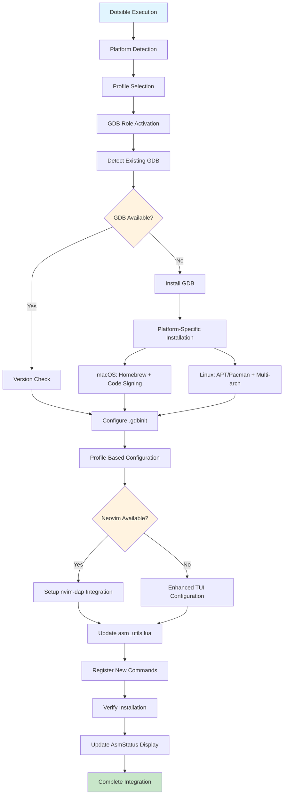

# Assembly Development Environment - GDB Integration Implementation Plan

## 📋 Executive Summary

This comprehensive plan integrates professional-grade GDB debugging capabilities into the existing Dotsible assembly development environment. The solution leverages the current Ansible-based infrastructure to automatically detect, install, and configure GDB with intelligent Neovim integration and optimized ARM64/AArch64 assembly debugging workflows.

## 🏗️ Current Architecture Analysis

### Existing Infrastructure Strengths
- **Mature Ansible Framework**: Robust cross-platform automation with conditional deployment
- **GNU Stow Integration**: Seamless dotfiles management with bidirectional editing
- **Multi-Architecture Support**: Complete coverage for ARM64, ARM32, x86_64, RISC-V
- **Enhanced Assembly Environment**: Production-ready asm-lsp integration with comprehensive toolchain detection
- **Platform Detection**: Sophisticated detection of OS, architecture, window managers, and environment types

### Integration Opportunities
- **Role-Based Architecture**: Existing `roles/applications/` structure perfect for GDB integration
- **Conditional Deployment**: Leverage existing platform/profile-based filtering
- **Template System**: Utilize existing template infrastructure for configuration files
- **Enhanced Status Reporting**: Extend current `:AsmStatus` command for debugger detection

## 🎯 Implementation Strategy

### Phase 1: Core GDB Integration Infrastructure

#### 1.1 New Ansible Role Creation
```
roles/applications/gdb/
├── tasks/
│   ├── main.yml                    # Main orchestration
│   ├── detect_gdb.yml             # GDB installation detection
│   ├── install_linux.yml          # Linux-specific installation
│   ├── install_macos.yml          # macOS-specific installation
│   ├── configure_gdbinit.yml      # .gdbinit configuration
│   ├── setup_neovim_integration.yml # Neovim DAP integration
│   └── verify_installation.yml    # Post-installation verification
├── templates/
│   ├── gdbinit.j2                 # Enhanced .gdbinit template
│   ├── gdbinit_minimal.j2         # Minimal profile template
│   ├── gdb_arm64_layout.j2        # ARM64-specific TUI layout
│   ├── nvim_dap_gdb.lua.j2        # nvim-dap configuration
│   └── gdb_commands.j2            # Custom GDB command definitions
├── vars/
│   ├── main.yml                   # Common variables
│   ├── darwin.yml                 # macOS-specific packages
│   ├── archlinux.yml             # Arch Linux packages
│   └── debian.yml                # Ubuntu/Debian packages
├── handlers/
│   └── main.yml                   # Service restart handlers
└── meta/
    └── main.yml                   # Role dependencies
```

#### 1.2 Platform-Specific Package Integration

**macOS (Homebrew)**:
```yaml
# group_vars/macos.yml additions
macos_packages:
  development:
    - gdb                          # GNU Debugger
    - lldb                         # LLVM Debugger (backup)
    - qemu                         # Emulation support
  
  cross_compilation:
    - aarch64-elf-gcc             # ARM64 cross-compiler
    - arm-none-eabi-gcc           # ARM32 cross-compiler
    - riscv64-elf-gcc             # RISC-V cross-compiler
```

**Linux (APT/Pacman)**:
```yaml
# group_vars/archlinux.yml additions
archlinux_packages:
  development:
    - gdb                          # GNU Debugger
    - gdb-multiarch               # Multi-architecture support
    - qemu-full                   # Complete QEMU suite
    - arm-none-eabi-gdb           # ARM debugging
    - aarch64-linux-gnu-gdb       # ARM64 debugging
```

### Phase 2: Enhanced Assembly Environment Integration

#### 2.1 Extended asm_utils.lua Module
```lua
-- Enhanced GDB Detection and Configuration
function M.detect_debuggers()
    local debuggers = {
        gdb = {
            command = "gdb",
            multiarch = "gdb-multiarch",
            arm64 = "aarch64-linux-gnu-gdb",
            arm32 = "arm-linux-gnueabihf-gdb",
            riscv = "riscv64-linux-gnu-gdb"
        },
        lldb = { command = "lldb" },
        qemu = {
            user_arm64 = "qemu-aarch64",
            user_arm32 = "qemu-arm",
            system_arm64 = "qemu-system-aarch64",
            system_x86_64 = "qemu-system-x86_64"
        }
    }
    
    local available = {}
    for debugger, variants in pairs(debuggers) do
        available[debugger] = {}
        for variant, cmd in pairs(variants) do
            available[debugger][variant] = vim.fn.executable(cmd) == 1
        end
    end
    
    return available
end

-- Enhanced AsmStatus Command
function M.show_debug_status()
    local debuggers = M.detect_debuggers()
    local dap_available = pcall(require, 'dap')
    
    print("🔧 ASSEMBLY DEBUGGING ENVIRONMENT")
    print("═══════════════════════════════════")
    
    -- GDB Status
    print("📍 GDB Debuggers:")
    for variant, available in pairs(debuggers.gdb) do
        local status = available and "✅" or "❌"
        print(string.format("  %s %s", status, variant))
    end
    
    -- Neovim Integration Status
    print("\n🔌 Neovim Integration:")
    print(string.format("  %s nvim-dap: %s", 
        dap_available and "✅" or "❌",
        dap_available and "Available" or "Not installed"))
    
    -- Configuration Status
    local gdbinit_exists = vim.fn.filereadable(vim.fn.expand("~/.gdbinit")) == 1
    print(string.format("  %s .gdbinit: %s",
        gdbinit_exists and "✅" or "❌",
        gdbinit_exists and "Configured" or "Missing"))
end
```

#### 2.2 New Vim Commands
```lua
-- Enhanced command registration
vim.api.nvim_create_user_command('AsmDebugStatus', function()
    require('asm_utils').show_debug_status()
end, { desc = 'Show assembly debugging environment status' })

vim.api.nvim_create_user_command('AsmGDB', function(opts)
    local arch = opts.args ~= "" and opts.args or "multiarch"
    require('asm_utils').launch_gdb_for_arch(arch)
end, { 
    nargs = '?',
    complete = function() return {'arm64', 'arm32', 'x86_64', 'riscv', 'multiarch'} end,
    desc = 'Launch GDB for specific architecture'
})

vim.api.nvim_create_user_command('AsmDAP', function()
    if pcall(require, 'dap') then
        require('dap').continue()
    else
        vim.notify("nvim-dap not available", vim.log.levels.WARN)
    end
end, { desc = 'Start DAP debugging session' })
```

### Phase 3: Advanced GDB Configuration System

#### 3.1 Comprehensive .gdbinit Template Features
- **ARM64-Specific Settings**: Architecture detection and optimization
- **TUI Configuration**: Enhanced terminal user interface layouts
- **Custom Display Layouts**: Specialized layouts for ARM64 debugging
- **Register Display Helpers**: ARM64 general and vector register visualization
- **Memory Visualization**: Enhanced memory dump and stack analysis
- **Instruction Analysis**: ARM64 instruction decoding and analysis
- **Calling Convention Checks**: ARM64 ABI compliance verification
- **Breakpoint Management**: Enhanced breakpoint setting and management
- **Step-through Debugging**: Context-aware stepping with register display

#### 3.2 Conditional Neovim DAP Integration
- **Automatic Detection**: Check for nvim-dap availability
- **ARM64 Assembly Configuration**: Specialized debugging configurations
- **Process Attachment**: Support for attaching to running processes
- **Custom Setup Commands**: ARM64-specific GDB initialization
- **Key Mappings**: Intuitive debugging key bindings

### Phase 4: Installation and Configuration Automation

#### 4.1 Platform-Specific Installation Logic
- **macOS**: Homebrew installation with code signing for debugging privileges
- **Linux**: APT/Pacman installation with multi-architecture support
- **Cross-Compilation**: Optional toolchain installation for multi-target development
- **Version Management**: Automatic detection and upgrade handling

#### 4.2 Profile-Based Configuration
- **Minimal Profile**: Basic debugging capabilities
- **Developer Profile**: Full feature set with cross-compilation support
- **Enterprise Profile**: Security-hardened configurations with audit logging

### Phase 5: Integration with Existing Conditional Deployment

#### 5.1 Conditional Deployment Logic
- **Profile-Based Features**: Different feature sets per user profile
- **Platform Detection**: Automatic adaptation to host system capabilities
- **Environment Awareness**: Personal vs enterprise configuration differences
- **Graceful Degradation**: Fallback configurations when advanced features unavailable

## 🔄 Implementation Workflow

### Integration Points with Existing System

1. **Ansible Role Integration**: Seamlessly fits into existing `roles/applications/` structure
2. **Conditional Deployment**: Leverages existing profile and platform detection
3. **GNU Stow Compatibility**: Maintains dotfiles structure for bidirectional editing
4. **Enhanced Assembly Environment**: Extends current asm-lsp and asm_utils.lua functionality
5. **Clean Output Integration**: Uses existing callback system for status reporting

### Mermaid Diagram: GDB Integration Architecture



## 📊 Expected Outcomes

### Enhanced Development Capabilities
- **Professional Debugging**: Full GDB integration with ARM64-optimized configurations
- **Cross-Platform Support**: Consistent debugging experience across macOS and Linux
- **Intelligent Integration**: Automatic Neovim DAP setup when available
- **Fallback Excellence**: Comprehensive TUI mode when GUI integration unavailable
- **Multi-Architecture**: Support for ARM64, ARM32, x86_64, and RISC-V debugging

### User Experience Improvements
- **Seamless Installation**: Zero-configuration setup through existing Dotsible workflow
- **Enhanced Status Reporting**: Extended `:AsmStatus` command showing debugger availability
- **Intuitive Commands**: New `:AsmGDB` and `:AsmDAP` commands for quick debugging access
- **Professional Workflows**: Industry-standard debugging configurations and layouts

### Maintenance and Extensibility
- **Modular Design**: Easy to extend with additional debuggers (LLDB, platform-specific tools)
- **Template-Based**: Configuration templates allow easy customization
- **Version Management**: Automatic detection and upgrade handling
- **Documentation Integration**: Comprehensive inline documentation and help systems

## 🚀 Implementation Files to Create

### Ansible Role Structure
1. **`roles/applications/gdb/tasks/main.yml`** - Main orchestration logic
2. **`roles/applications/gdb/tasks/detect_gdb.yml`** - GDB detection and version checking
3. **`roles/applications/gdb/tasks/install_linux.yml`** - Linux package installation
4. **`roles/applications/gdb/tasks/install_macos.yml`** - macOS Homebrew installation
5. **`roles/applications/gdb/tasks/configure_gdbinit.yml`** - .gdbinit template deployment
6. **`roles/applications/gdb/tasks/setup_neovim_integration.yml`** - nvim-dap configuration
7. **`roles/applications/gdb/tasks/verify_installation.yml`** - Post-installation verification

### Configuration Templates
8. **`roles/applications/gdb/templates/gdbinit.j2`** - Comprehensive ARM64-optimized .gdbinit
9. **`roles/applications/gdb/templates/gdbinit_minimal.j2`** - Minimal profile .gdbinit
10. **`roles/applications/gdb/templates/nvim_dap_gdb.lua.j2`** - nvim-dap GDB configuration

### Variable Files
11. **`roles/applications/gdb/vars/main.yml`** - Common GDB variables
12. **`roles/applications/gdb/vars/darwin.yml`** - macOS-specific packages
13. **`roles/applications/gdb/vars/debian.yml`** - Ubuntu/Debian packages
14. **`roles/applications/gdb/vars/archlinux.yml`** - Arch Linux packages

### Enhanced Assembly Environment
15. **Enhanced `files/dotfiles/nvim/.config/nvim/lua/asm_utils.lua`** - GDB integration functions
16. **Updated `group_vars/all/profiles.yml`** - Profile-based GDB features
17. **Updated platform-specific group_vars** - Package additions for GDB support

This comprehensive implementation plan provides a production-ready solution that integrates seamlessly with the existing Dotsible infrastructure while delivering professional-grade assembly debugging capabilities optimized for ARM64/AArch64 development.