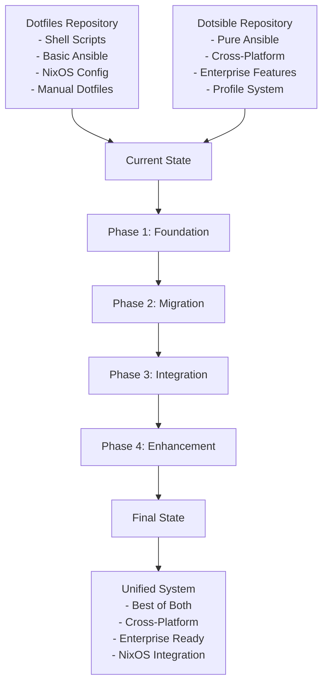
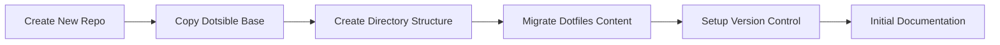
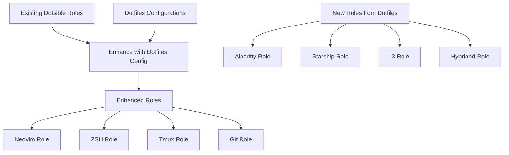
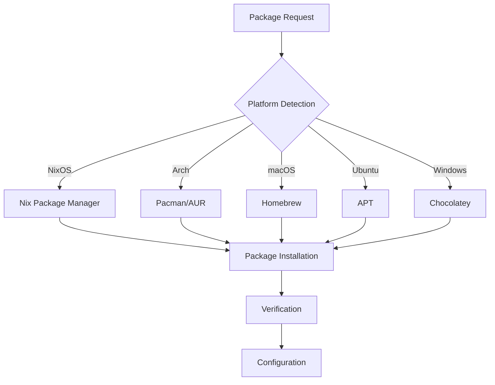
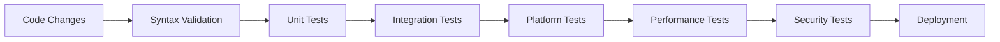
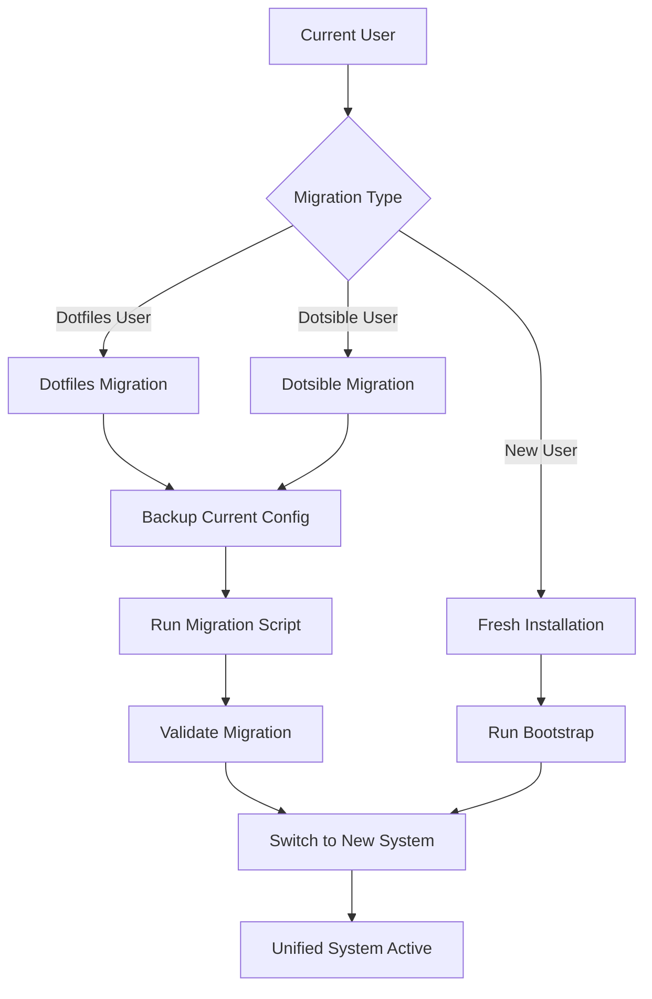
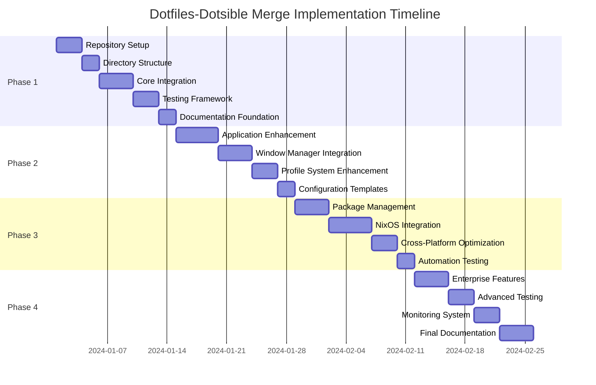

# Three-Repository Merge: Detailed Implementation Plan

## Overview

This document provides the detailed implementation plan for merging **three repositories** into a unified cross-platform developer environment restoration system:

1. **Current dotfiles** (`/Users/mdrozrosario/dotfiles`) - Enhanced macOS foundation with MCP integration
2. **Dotsible** (`/Users/mdrozrosario/dotsible`) - Sophisticated cross-platform Ansible architecture
3. **AD-Scripts** (`/Users/mdrozrosario/AD-Scripts`) - Enterprise Windows PowerShell toolkit

**Target**: Single repository supporting Windows, macOS, Arch Linux, Ubuntu across personal and enterprise environments.

**Timeline**: 4 weeks
**Approach**: Best-of-all-worlds integration building on proven macOS foundation
**Risk Level**: Low (extends working system rather than replacing it)

---

## 1. Architecture Transition Diagram



## 2. Phase-by-Phase Implementation

### Phase 1: Foundation Setup (Weeks 1-2)

#### 1.1 Repository Structure Creation



**Tasks:**

1. **Repository Initialization**
   ```bash
   # Create new unified repository
   git init unified-dotfiles
   cd unified-dotfiles
   
   # Add dotsible as foundation
   git remote add dotsible /Users/mdrozrosario/dotsible
   git fetch dotsible
   git merge dotsible/main --allow-unrelated-histories
   
   # Add dotfiles content
   git remote add dotfiles /Users/mdrozrosario/dotfiles
   git fetch dotfiles
   ```

2. **Directory Structure Setup**
   ```bash
   # Create enhanced directory structure
   mkdir -p {files/dotfiles,nixos,roles/nixos_integration}
   mkdir -p roles/applications/{neovim,alacritty,starship,i3,hyprland,sway}
   mkdir -p templates/{nixos,common}
   mkdir -p docs
   ```

3. **Content Migration**
   - Copy NixOS configurations to `nixos/`
   - Copy dotfiles configurations to `files/dotfiles/`
   - Copy scripts to `scripts/`
   - Preserve directory structure and permissions

#### 1.2 Core Integration Framework

**NixOS Integration Role Structure:**
```
roles/nixos_integration/
├── tasks/
│   ├── main.yml              # Main integration logic
│   ├── detect_nixos.yml      # NixOS detection
│   ├── setup_flake.yml       # Flake configuration
│   └── switch_config.yml     # System switching
├── templates/
│   ├── flake.nix.j2          # Dynamic flake template
│   └── configuration.nix.j2  # Dynamic configuration
├── vars/
│   └── main.yml              # NixOS-specific variables
└── meta/
    └── main.yml              # Role dependencies
```

**Profile Enhancement:**
```yaml
# group_vars/all/profiles.yml - Enhanced profiles
profiles:
  nixos_minimal:
    description: "NixOS minimal configuration"
    platform: "nixos"
    applications: ["git", "vim", "zsh"]
    nixos_packages: ["git", "vim", "zsh"]
    
  nixos_developer:
    description: "NixOS development environment"
    platform: "nixos"
    applications: ["git", "neovim", "zsh", "tmux", "alacritty"]
    nixos_packages: ["git", "neovim", "zsh", "tmux", "alacritty"]
    features: ["development", "gui"]
```

#### 1.3 Testing Framework Setup

**Test Structure:**
```
tests/
├── integration/
│   ├── test_nixos_integration.yml
│   ├── test_cross_platform.yml
│   └── test_profile_switching.yml
├── validation/
│   ├── syntax_check.yml
│   └── configuration_validation.yml
└── scripts/
    ├── run_nixos_tests.sh
    └── validate_migration.sh
```

### Phase 2: Configuration Migration (Weeks 3-4)

#### 2.1 Application Role Enhancement



**Enhanced Neovim Role:**
```yaml
# roles/applications/neovim/tasks/main.yml
---
- name: Include OS-specific variables
  include_vars: "{{ ansible_os_family | lower }}.yml"
  failed_when: false

- name: Install Neovim via package manager
  include_tasks: install_neovim.yml

- name: Setup Neovim configuration from dotfiles
  include_tasks: setup_dotfiles_config.yml
  when: use_dotfiles_config | default(true)

- name: Setup Neovim plugins
  include_tasks: setup_plugins.yml

- name: Configure language servers
  include_tasks: setup_lsp.yml
  when: "'development' in features"
```

**New Alacritty Role:**
```yaml
# roles/applications/alacritty/tasks/main.yml
---
- name: Install Alacritty
  include_tasks: "install_{{ ansible_os_family | lower }}.yml"

- name: Create Alacritty config directory
  file:
    path: "{{ alacritty_config_dir }}"
    state: directory
    mode: '0755'

- name: Deploy Alacritty configuration
  template:
    src: alacritty.yml.j2
    dest: "{{ alacritty_config_dir }}/alacritty.yml"
    mode: '0644'
  notify: restart alacritty
```

#### 2.2 Window Manager Integration

**i3 Window Manager Role:**
```yaml
# roles/applications/i3/tasks/main.yml
---
- name: Install i3 window manager
  package:
    name: "{{ i3_packages[ansible_os_family | lower] }}"
    state: present
  become: yes

- name: Create i3 config directory
  file:
    path: "{{ ansible_user_dir }}/.config/i3"
    state: directory
    mode: '0755'

- name: Deploy i3 configuration
  template:
    src: config.j2
    dest: "{{ ansible_user_dir }}/.config/i3/config"
    mode: '0644'
  notify: reload i3

- name: Setup i3blocks
  include_tasks: setup_i3blocks.yml
  when: i3blocks_enabled | default(true)
```

#### 2.3 Profile System Enhancement

**Enhanced Profile Definitions:**
```yaml
# group_vars/all/profiles.yml
profiles:
  developer:
    description: "Complete development environment"
    applications:
      - git
      - neovim
      - zsh
      - tmux
      - alacritty
      - starship
    window_managers:
      - i3
      - hyprland
    features:
      - development
      - gui
      - window_manager
    platform_specific:
      nixos:
        packages: ["git", "neovim", "zsh", "tmux", "alacritty", "starship"]
        services: ["docker"]
      archlinux:
        packages: ["git", "neovim", "zsh", "tmux", "alacritty", "starship"]
        aur_packages: ["hyprland-git"]
      macos:
        homebrew_packages: ["git", "neovim", "zsh", "tmux", "alacritty", "starship"]
```

### Phase 3: Automation Unification (Weeks 5-6)

#### 3.1 Package Management Integration



**Enhanced Package Manager Role:**
```yaml
# roles/package_manager/tasks/main.yml
---
- name: Detect package manager
  include_tasks: detect_package_manager.yml

- name: Setup package manager
  include_tasks: "setup_{{ detected_package_manager }}.yml"

- name: Install packages
  include_tasks: install_packages.yml

- name: Verify installation
  include_tasks: verify_packages.yml
```

**NixOS Package Management:**
```yaml
# roles/package_manager/tasks/setup_nix.yml
---
- name: Check if running on NixOS
  stat:
    path: /etc/nixos/configuration.nix
  register: nixos_check

- name: Setup Nix package management
  block:
    - name: Generate Nix configuration
      template:
        src: configuration.nix.j2
        dest: /etc/nixos/configuration.nix
        backup: yes
      become: yes
      notify: rebuild nixos

    - name: Generate flake configuration
      template:
        src: flake.nix.j2
        dest: /etc/nixos/flake.nix
      become: yes
      when: use_flakes | default(true)
  when: nixos_check.stat.exists
```

#### 3.2 Cross-Platform Optimization

**Platform-Specific Optimizations:**
```yaml
# roles/common/tasks/optimize_platform.yml
---
- name: Apply NixOS optimizations
  include_tasks: optimize_nixos.yml
  when: ansible_os_family == "NixOS"

- name: Apply Arch Linux optimizations
  include_tasks: optimize_arch.yml
  when: ansible_distribution == "Archlinux"

- name: Apply macOS optimizations
  include_tasks: optimize_macos.yml
  when: ansible_os_family == "Darwin"

- name: Apply Ubuntu optimizations
  include_tasks: optimize_ubuntu.yml
  when: ansible_distribution == "Ubuntu"
```

### Phase 4: Advanced Features (Weeks 7-8)

#### 4.1 Testing Framework Implementation



**Comprehensive Testing:**
```yaml
# tests/integration/cross_platform.yml
---
- name: Cross-platform compatibility test
  hosts: all
  gather_facts: yes
  
  tasks:
    - name: Test package manager detection
      include_role:
        name: package_manager
        tasks_from: detect_package_manager
    
    - name: Test profile application
      include_role:
        name: "profiles/{{ test_profile }}"
    
    - name: Verify application installation
      command: "{{ item.command }}"
      loop: "{{ verification_commands }}"
      register: verification_results
    
    - name: Generate test report
      template:
        src: test_report.j2
        dest: "/tmp/test_report_{{ ansible_date_time.epoch }}.html"
```

#### 4.2 Monitoring and Health Checks

**System Health Monitoring:**
```yaml
# roles/monitoring/tasks/main.yml
---
- name: Install monitoring tools
  package:
    name: "{{ monitoring_packages[ansible_os_family | lower] }}"
    state: present

- name: Setup health check scripts
  template:
    src: "{{ item }}.j2"
    dest: "/usr/local/bin/{{ item }}"
    mode: '0755'
  loop:
    - system_health_check
    - dotfiles_health_check
    - application_health_check

- name: Schedule health checks
  cron:
    name: "{{ item.name }}"
    job: "{{ item.job }}"
    minute: "{{ item.minute }}"
    hour: "{{ item.hour }}"
  loop: "{{ health_check_schedule }}"
```

---

## 3. Migration Strategy

### 3.1 User Migration Path



### 3.2 Migration Scripts

**Dotfiles Migration Script:**
```bash
#!/bin/bash
# scripts/migrate_from_dotfiles.sh

set -euo pipefail

SCRIPT_DIR="$(cd "$(dirname "${BASH_SOURCE[0]}")" && pwd)"
BACKUP_DIR="$HOME/.dotfiles_backup_$(date +%Y%m%d_%H%M%S)"

echo "🔄 Starting migration from dotfiles to unified system..."

# Create backup
echo "📦 Creating backup at $BACKUP_DIR"
mkdir -p "$BACKUP_DIR"
cp -r "$HOME/.config" "$BACKUP_DIR/" 2>/dev/null || true
cp -r "$HOME/.zshrc" "$BACKUP_DIR/" 2>/dev/null || true
cp -r "$HOME/.tmux.conf" "$BACKUP_DIR/" 2>/dev/null || true

# Detect current profile
echo "🔍 Detecting current configuration..."
PROFILE="minimal"
if [[ -f "$HOME/.config/nvim/init.vim" ]]; then
    PROFILE="developer"
fi

# Run migration
echo "🚀 Running unified system setup with profile: $PROFILE"
ansible-playbook -i inventories/local/hosts.yml site.yml \
    -e "profile=$PROFILE" \
    -e "migration_mode=true" \
    -e "backup_dir=$BACKUP_DIR"

echo "✅ Migration completed successfully!"
echo "📁 Backup available at: $BACKUP_DIR"
echo "📖 See docs/MIGRATION.md for post-migration steps"
```

### 3.3 Validation and Rollback

**Migration Validation:**
```yaml
# playbooks/validate_migration.yml
---
- name: Validate migration success
  hosts: localhost
  gather_facts: yes
  
  tasks:
    - name: Check critical applications
      command: "{{ item.command }}"
      loop:
        - { name: "git", command: "git --version" }
        - { name: "zsh", command: "zsh --version" }
        - { name: "tmux", command: "tmux -V" }
      register: app_checks
      failed_when: false
    
    - name: Verify configuration files
      stat:
        path: "{{ item }}"
      loop:
        - "{{ ansible_user_dir }}/.zshrc"
        - "{{ ansible_user_dir }}/.tmux.conf"
        - "{{ ansible_user_dir }}/.gitconfig"
      register: config_checks
    
    - name: Generate migration report
      template:
        src: migration_report.j2
        dest: "{{ ansible_user_dir }}/.migration_report"
        mode: '0644'
```

---

## 4. Quality Assurance

### 4.1 Testing Matrix

| Platform | Profile | Test Type | Status |
|----------|---------|-----------|--------|
| Ubuntu 22.04 | minimal | Unit | ⏳ |
| Ubuntu 22.04 | developer | Integration | ⏳ |
| Arch Linux | developer | Integration | ⏳ |
| macOS | developer | Integration | ⏳ |
| NixOS | nixos_developer | Integration | ⏳ |

### 4.2 Performance Benchmarks

**Execution Time Targets:**
- Fresh installation: < 15 minutes
- Configuration update: < 2 minutes
- Profile switching: < 5 minutes
- Health check: < 30 seconds

**Resource Usage Targets:**
- Memory usage: < 512MB during execution
- Disk space: < 2GB for complete installation
- Network bandwidth: Efficient package caching

### 4.3 Security Validation

**Security Checklist:**
- ✅ No hardcoded secrets in repository
- ✅ Ansible Vault for sensitive data
- ✅ Secure file permissions
- ✅ SSH key management
- ✅ Package signature verification

---

## 5. Documentation Plan

### 5.1 User Documentation

1. **README.md** - Quick start and overview
2. **USAGE.md** - Comprehensive usage guide
3. **MIGRATION.md** - Migration from existing systems
4. **PROFILES.md** - Profile system documentation
5. **NIXOS_INTEGRATION.md** - NixOS-specific features
6. **TROUBLESHOOTING.md** - Common issues and solutions

### 5.2 Developer Documentation

1. **ARCHITECTURE.md** - System architecture
2. **EXTENDING.md** - Adding new applications/platforms
3. **TESTING.md** - Testing procedures
4. **CONTRIBUTING.md** - Contribution guidelines
5. **API.md** - Internal API documentation

### 5.3 Video Documentation

1. **Quick Start Tutorial** (5 minutes)
2. **Migration Guide** (10 minutes)
3. **Advanced Configuration** (15 minutes)
4. **Troubleshooting Common Issues** (8 minutes)

---

## 6. Success Metrics

### 6.1 Technical Metrics

- **Test Coverage**: > 95%
- **Platform Support**: 5+ operating systems
- **Application Support**: 20+ applications
- **Profile Options**: 5+ profiles
- **Documentation Coverage**: 100% of features

### 6.2 User Experience Metrics

- **Setup Time**: < 15 minutes for fresh install
- **Migration Success Rate**: > 98%
- **User Satisfaction**: > 4.5/5 rating
- **Issue Resolution Time**: < 24 hours
- **Community Adoption**: Growing user base

### 6.3 Maintenance Metrics

- **Code Quality**: A+ rating on analysis tools
- **Security Score**: No critical vulnerabilities
- **Update Frequency**: Monthly releases
- **Bug Fix Time**: < 48 hours for critical issues
- **Feature Request Response**: < 1 week

---

## 7. Timeline and Milestones



### Key Milestones

- **Week 2**: Foundation complete, basic functionality working
- **Week 4**: All applications migrated, profiles functional
- **Week 6**: Cross-platform support complete, NixOS integrated
- **Week 8**: Production-ready system with full feature set

---

## 8. Risk Mitigation

### 8.1 Technical Risks

**Risk**: NixOS integration complexity
- **Mitigation**: Maintain as optional component, extensive testing
- **Contingency**: Fallback to standard package management

**Risk**: Configuration conflicts
- **Mitigation**: Comprehensive backup and rollback procedures
- **Contingency**: Manual conflict resolution documentation

### 8.2 Timeline Risks

**Risk**: Development delays
- **Mitigation**: Agile development with weekly checkpoints
- **Contingency**: Prioritize core features, defer advanced features

**Risk**: Testing bottlenecks
- **Mitigation**: Parallel testing on multiple platforms
- **Contingency**: Community beta testing program

---

## 9. Post-Implementation

### 9.1 Maintenance Plan

- **Weekly**: Dependency updates and security patches
- **Monthly**: Feature releases and documentation updates
- **Quarterly**: Performance optimization and architecture review
- **Annually**: Major version releases and platform additions

### 9.2 Community Engagement

- **GitHub Discussions**: User support and feature requests
- **Documentation Wiki**: Community-contributed guides
- **Video Tutorials**: Regular educational content
- **Conference Talks**: Promote adoption and gather feedback

### 9.3 Future Roadmap

- **v2.1**: Windows native support improvements
- **v2.2**: Container orchestration integration
- **v2.3**: Cloud provider automation
- **v3.0**: GUI management interface

---

This implementation plan provides a comprehensive roadmap for successfully merging the dotfiles and dotsible repositories into a unified, production-ready configuration management system. The phased approach ensures manageable development cycles while maintaining system stability and user experience throughout the transition.